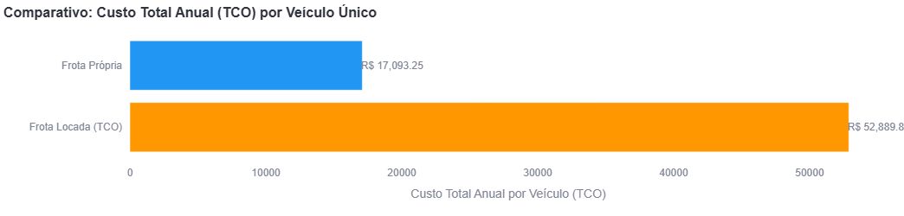
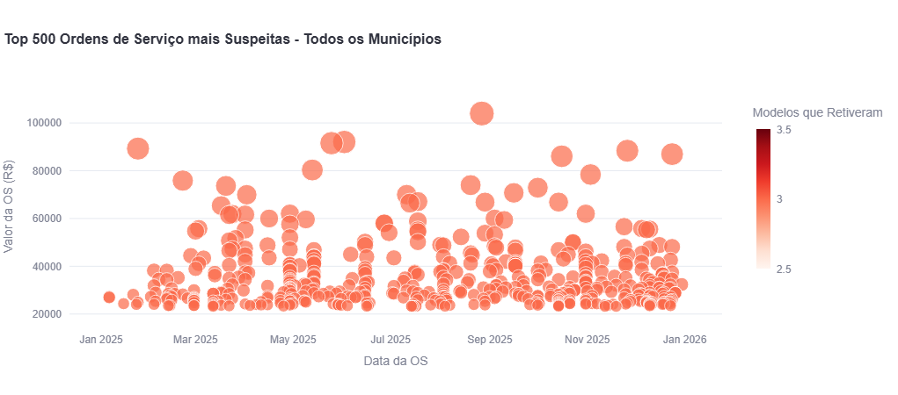
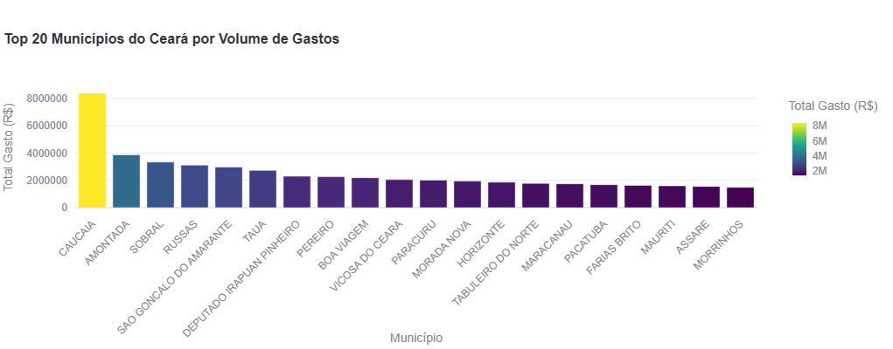
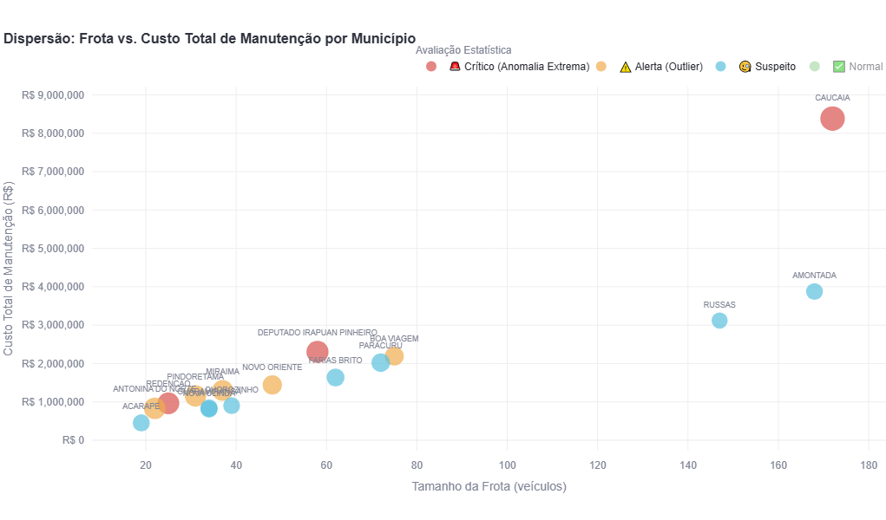
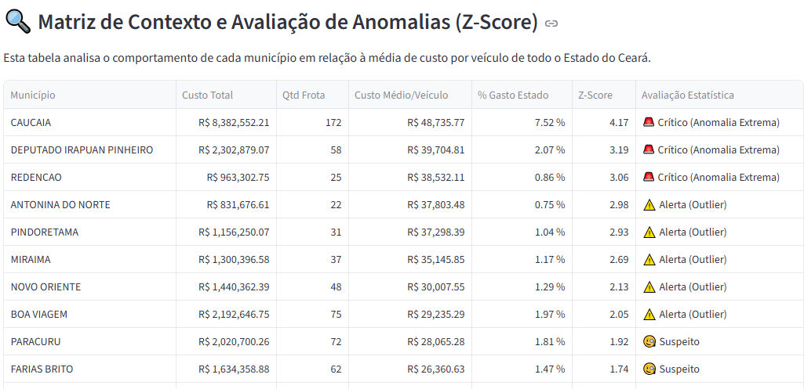
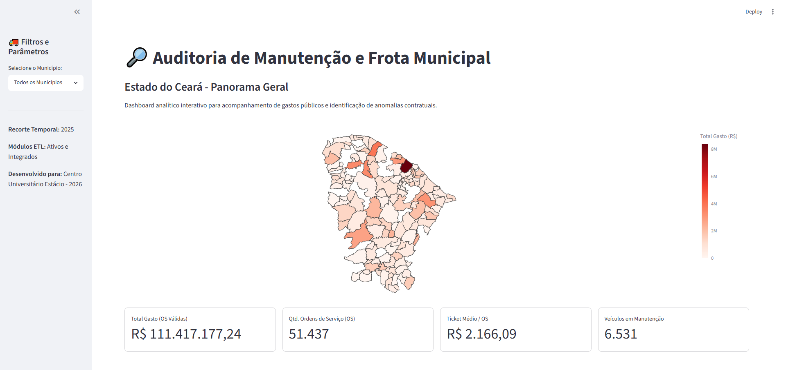
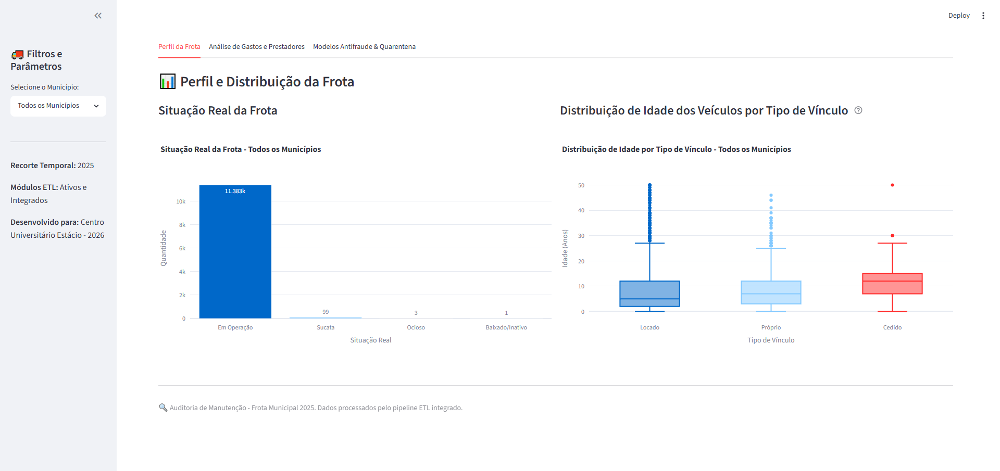

# 🚚 Auditoria de Frota Municipal — Análise de Viabilidade Financeira e TCO entre Frota Própria e Frota Locada (Ceará, 2025)
 
[](https://www.python.org/)
[](https://streamlit.io/)
[]()
[](LICENSE)
 
**Fonte:** Sistema de Informações Municipais (SIM) — TCE-CE  
**Recorte:** 184 municípios do Ceará — ano completo de 2025  
**Tabelas:** veiculos_municipais_2025, veiculos_manutencoes_2025, veiculos_locados_2025, veiculos_cedidos_2025  
**Disciplina:** Tópicos de Big Data em Python

> Centro Universitário Estácio, 2026

---

## 👥 Autores e Desenvolvedores

Este projeto foi desenvolvido como requisito avaliativo para a disciplina de Tópicos de Big Data em Python por:

- **Guilherme Almeida** — *Systems Developer & Bodybuilding Athlete* — [GitHub](https://github.com/gwilhermealm)
- **Isaac Miranda** — *Systems Developer & Bodybuilding Athlete* — [GitHub](https://github.com/isaacmorais41-cyber)
- **Weberson Costa** — *Systems Developer & Bodybuilding Athlete* — [GitHub](https://github.com/WebersonCosta)
 
---
 
## 📌 Resumo
 
Este projeto aplica um pipeline avançado de Engenharia de Dados, Detecção de Anomalias por Machine Learning e Auditoria de Contratos Públicos à frota de veículos municipais do Estado do Ceará no exercício de 2025. A **questão central de pesquisa** que orientou o desenvolvimento e a modelagem foi:
 
> **"Frota Própria ou Frota Locada: qual modelo de gestão apresenta o menor Custo Total de Propriedade (TCO) para os municípios cearenses"**
 
Para respondê-la, estruturou-se um pipeline ETL capaz de unificar os históricos de ordens de serviço de manutenção (OS) com os valores de parcelas de aluguel individualizadas por veículo único. O ecossistema analítico e os indicadores antifraude são disponibilizados em um **Dashboard Interativo de Inteligência e Geolocalização** em Streamlit.

---
 
## 🔎 Contexto e Problema Analítico
 
Em 2025, os municípios do Ceará movimentaram **R$ 111,4 milhões** em ordens de serviço de manutenção de veículos e empenharam **R$ 238,5 milhões** em contratos de locação de frotas terceirizadas. A ausência de cruzamentos automatizados entre o cadastro patrimonial, as notas fiscais de oficinas e as cláusulas restritivas de aluguel oculta severas ineficiências na máquina pública.
 
As principais vulnerabilidades fiscais reveladas pelo sistema foram:
 
**1. Omissão de Cadeia de Prestadores finais (Intermediários)** CNPJs gerenciadores de frotas ("cartões de manutenção") centralizam valores milionários, omitindo os estabelecimentos reais que executaram os reparos. Em Caucaia, um único CNPJ reteve cerca de **R$ 8,00 milhões**, reduzindo a transparência pública.
 
**2. Falta de Detalhes Técnicos nas Ordens de Serviço** Aproximadamente **R$ 17,80 milhões** foram liquidados em 12.887 OSs cujas descrições possuíam menos de 25 caracteres (ex: *"Serviço realizado"*, *"Reparo geral"*), inviabilizando auditorias digitais de conformidade de preços.
 
**3. Descompasso Orçamentário e Retenções Críticas** Divergência acumulada de **R$ 9,90 milhões** entre os valores faturados em oficinas e os empenhados originalmente. O sistema isolou **R$ 5,40 milhões** em quarentena de investigação por inconsistências orçamentárias graves (divergências > R$ 100 mil por Nota de Empenho).
 
---
 
## 🎯 Questão de Pesquisa e Hipóteses
 
A modelagem estatística e financeira avaliou as decisões logísticas com base em três hipóteses centrais:
 
- **H₁ (Hipótese de Eficiência da Frota Locada):** Veículos locados, por serem mais novos, apresentam menor custo unitário de oficina do que os próprios, justificando a assinatura contratual.
- **H₂ (Hipótese de Risco Oculto da Locação sem Cobertura):** O valor de aquisição do contrato de locação somado a despesas de oficina residuais (em contratos sem cobertura) torna a terceirização mais cara que a gestão de frota própria antiga.
- **H₃ (Hipótese de Duplicidade Contratual):** Municípios efetuaram pagamentos diretos por manutenções de veículos cujos contratos de locação já previam cobertura integral de oficina pela empresa locadora.

### 📝 Conclusões das Hipóteses
Após a consolidação do pipeline de TCO, os resultados empíricos demonstraram que:
* **H₁ foi confirmada:** O gasto médio anual puro de oficina da frota própria foi de **R$ 17.093,25** por veículo ativo, enquanto a frota locada exigiu apenas **R$ 618,83** de manutenção residual.
* **H₂ foi confirmada:** A inclusão do valor do contrato de locação anualizado inverteu a vantagem financeira. O TCO anualizado do veículo locado atingiu **R$ 52.889,84**, provando que o contrato de aluguel supera drasticamente os custos acumulados de oficina de um veículo próprio antigo de curto prazo.
* **H₃ foi confirmada:** O cruzamento direto de Renavams identificou fraudes e falhas operacionais graves de fiscalização, onde prefeituras pagaram oficinas mecânicas particulares por consertos de veículos que possuíam cobertura contratual obrigatória pela locadora.
 
---
 
## 📊 Principais Resultados
 
### Viabilidade Financeira: Frota Própria vs. Frota Locada
 

 
O cruzamento refinado de dados revelou um contraste drástico na eficiência operacional e financeira dos modelos de gestão avaliados no Estado do Ceará:
 
- **Frota Própria:** O custo médio anual de manutenção atingiu a marca de **R$ 17.093,25** por veículo único ativo e em operação. 
- **Frota Locada (sem cobertura de oficina):** O subgrupo de veículos alugados onde o município assumiu diretamente as despesas de manutenção apresentou um custo médio anual de apenas **R$ 618,83** por unidade.
- **O Impacto da Discrepância:** Esta diferença representa uma economia interna de **96,3%** no custo de oficina por veículo individual quando se adota o modelo locado. 

Os dados demonstram que a terceirização, mesmo sob contratos sem cobertura de manutenção corretiva e preventiva pela locadora, mitiga drasticamente o impacto financeiro direto nas contas municipais. O fator preponderante para esse comportamento é a idade média e obsolescência da frota própria, que gera quebras crônicas e severas em peças de alto valor, enquanto a frota locada usufrui de ciclos constantes de renovação e menor desgaste mecânico acumulado.
 
### Anomalias e Score de Suspeição (Isolation Forest + IQR + Z-Score)
 

 
A camada de inteligência analítica submeteu a base de dados a três algoritmos estatísticos e de Machine Learning concorrentes para gerar um **Score de Suspeição acumulado (de 0 a 3)**. O comportamento individual dos modelos de detecção de anomalias revelou:
 
- **Outliers por Isolation Forest:** O modelo de Machine Learning não-supervisionado isolou **2.564 Ordens de Serviço** com comportamento multidimensional anômalo.
- **Outliers por IQR (Amplitude Interquartil):** A triagem estatística robusta identificou **6.216 Ordens de Serviço** que superaram o limiar de corte superior ($Q3 + 1.5 \times IQR$).
- **Outliers por Z-Score:** O modelo de desvio padrão identificou **1.042 Ordens de Serviço** extremas que se posicionaram a mais de 3.0 desvios padrões acima da média do Estado ($|z| > 3.0$).

As instâncias posicionadas no topo do gráfico de dispersão representam as Ordens de Serviço de maior criticidade orçamentária (com picos que ultrapassam R$ 100.000,00 por conserto individual). O cruzamento dessas três camadas mapeia os registros com **Score Máximo (3)**, permitindo que a auditoria ignore ruídos estatísticos normais e foque seus esforços de fiscalização e abertura de processos administrativos exclusivamente nas anomalias severas e simultâneas da frota estadual.
 
### Distribuição de Gastos por Município
 

 
A análise descentralizada revelou uma forte concentração geográfica e demográfica nos volumes liquidados para manutenção de frotas no Estado do Ceará:
 
- **Liderança Isolada:** O município de **Caucaia** lidera o ranking estadual com uma larga margem de distanciamento, acumulando mais de **R$ 8,0 milhões** em despesas de oficina.
- **Concentração do Top 5:** Logo em seguida, os municípios de **Amontada** (aproximando-se de R$ 4,0 milhões), **Sobral**, **Russas** e **São Gonçalo do Amarante** completam o bloco de maiores gastos, com despesas flutuando na faixa entre R$ 3,0 milhões e R$ 3,8 milhões.
- **Padrão de Porte e Comportamento:** Embora cidades de grande porte demográfico e extensas malhas territoriais (como Caucaia e Sobral) apresentem uma tendência natural a despesas elevadas, a presença marcante de municípios de médio porte no topo do ranking (como Amontada, Russas e Tauá) evidencia que a variação de gastos não é puramente demográfica, mas fortemente influenciada pelo comportamento local de fiscalização de contratos e pela maturidade operacional de suas frotas próprias.

O agrupamento desses dados serve como uma bússola de priorização para o controle externo, indicando que uma parcela massiva do orçamento de manutenção do Estado está concentrada em poucos centros de despesa, justificando auditorias focadas e contínuas nessas regiões líderes.
 
### Matriz de Contexto e Avaliação Estadual (Z-Score por Município)
 



 
Para evitar que municípios com frotas massivas fossem injustamente classificados como anômalos apenas pelo volume bruto, a Matriz de Contexto calcula o **Z-Score baseado no Custo Médio por Veículo**. Esse método isola desvios padronizados reais e classificou as administrações municipais em categorias críticas de controle:
 
- **🔴 Crítico (Anomalia Extrema — $Z > 3.0$):** Três municípios romperam a barreira estatística de segurança máxima. **Caucaia** lidera com um Z-Score severo de **4.17** (gasto médio de R$ 48.735,77 por veículo único). Contudo, o modelo revelou anomalias graves em municípios de menor porte: **Deputado Irapuan Pinheiro** ($Z = 3.19$ e R$ 39.704,81/veículo) e **Redenção** ($Z = 3.06$ e R$ 38.532,11/veículo), indicando distorções locais profundas no custo unitário de suas oficinas.
- **🟡 Alerta (Outlier — $2.0 < Z \le 3.0$):** Cinco municípios foram categorizados sob atenção imediata por apresentarem comportamento de custos muito acima da curva normal do Estado: **Antonina do Norte** ($Z = 2.98$), **Pindoretama** ($Z = 2.93$), **Miraima** ($Z = 2.69$), **Novo Oriente** ($Z = 2.13$) e **Boa Viagem** ($Z = 2.05$).
- **🔵 Suspeito ($1.0 < Z \le 2.0$):** Cidades de médio e grande porte, como **Paracuru** ($Z = 1.92$) e **Farias Brito** ($Z = 1.74$), mantêm-se em monitoramento preventivo na zona de transição estatística.

A combinação entre a dispersão espacial do Bubble Chart e os dados tabulados demonstra visualmente a eficiência da filtragem: enquanto municípios como Amontada e Russas geram altos volumes de gasto absoluto devido ao tamanho de suas frotas, seus posicionamentos permanecem na faixa de normalidade ou suspeição moderada. A verdadeira criticidade de auditoria isolada pelo sistema está concentrada nas esferas que combinam frotas reduzidas com faturamento de oficina hipertrofiado.
 
### Irregularidades de Conformidade Contratual (Duplicidade de Custos)
 
 
O cruzamento automatizado entre a base de execuções de oficinas e as regras de negócio dos contratos de locação revelou indícios consistentes de falha de controle interno e potenciais danos ao erário. O sistema identificou um total de **59 Ordens de Serviço (OS)** emitidas e pagas diretamente pelas administrações municipais para **14 veículos locados** cuja cobertura de manutenção preventiva e corretiva já era de responsabilidade integral das empresas locadoras contratadas. Esta inconformidade operacional resultou em um volume financeiro total pago indevidamente de **R$ 69.661,51**. O painel isola esses registros em uma tabela detalhada com número da OS, secretaria responsável e oficina executora, fornecendo um roteiro pronto e otimizado para auditorias priority de campo.

 
---
 
## ⚙️ Arquitetura da Solução
 
O sistema é organizado de forma modular com quatro componentes principais na pasta `src/`:
 
```
Analise de Dados de Manutencao - Frota Municipal/
│
├── dados/                         # Bases originais comprimidas (CSV, separador "¬")
│   ├── veiculos.csv
│   ├── veiculos_manutencao.csv
│   ├── veiculos_locados.csv
│   └── veiculos_cedidos.csv
│
├── src/                           # Código-fonte Python
│   ├── app.py                     # Frontend Streamlit e visualizações Plotly
│   ├── config.py                  # Parâmetros estatísticos, regras de negócio e caminhos
│   ├── etl.py                     # Engine de Extração, Transformação e Carga
│   └── quarentena.py              # Regras financeiras e isolamento de dados
│
└── README.md
```
 
### 1. Carregamento dos Dados e Engine de ETL (`src/etl.py`)

Todos os arquivos foram exportados do banco SIM/TCE-CE via DBeaver com separador `¬`.

| Arquivo | Descrição |
|---|---|
| `veiculos.csv` | Cadastro da frota municipal |
| `veiculos_manutencao.csv` | Manutenções com execução financeira, destinação e dados da Receita Federal |
| `veiculos_locados.csv` | Contratos de locação com modalidade e cláusulas |
| `veiculos_cedidos.csv` | Termos de cessão entre municípios |

---
> **Nota sobre a tabela de manutenções:** é o resultado de um join entre a tabela 995 do SIM,
> a view de execução orçamentária, a tabela de destinações e os dados da Receita Federal.
> Isso elimina a necessidade de carregar tabelas auxiliares separadas.
 
- **Sanitização de Strings:** Normalização via decomposição Unicode NFKD para remoção automática de acentos e padronização em caixa alta.
- **Normalização de CNPJ/CPF:** Padronização e limpeza de documentos de fornecedores.
- **Deduplicação por Moda:** Construção de um dicionário mestre de Razão Social por CNPJ utilizando `.mode()` estatístico para evitar duplicidades geradas por erros de digitação no ranking de prestadores.
- **Deduplicação de Contratos Locados:** Eliminação de aditivos contratuais redundantes com base em regras de prioridade temporal e modal definidas no `config.py`.
### 2. Triagem e Quarentena Financeira (`src/quarentena.py`)
 
Audita o descompasso orçamentário agrupando gastos de OSs por Nota de Empenho e calculando a diferença em relação ao valor empenhado. Os dados são particionados em três sub-datasets:
 
| Dataset | Critério | Finalidade |
|---|---|---|
| `df_valido` | Diferença ≤ R$ 0,01 | Base principal de análise |
| `df_investigacao` | Diferença entre R$ 10k e R$ 100k | Investigação moderada |
| `df_quarentena` | Diferença > R$ 100k | Isolamento crítico, evita distorções estatísticas |
 
### 3. Integração com APIs Governamentais
 
- **DE-PARA IBGE via TCE-CE:** Conversão do código interno municipal (3 dígitos) para o código oficial IBGE (6 dígitos), habilitando a geolocalização no mapa cloroplético.
- **Orçamento LOA por Secretaria:** Consumo em tempo real do endpoint `/orcamento_despesa` do TCE-CE para calcular o percentual do orçamento de cada órgão consumido por despesas de manutenção de frota.
- **Resiliência:** Tratamento rigoroso de exceções e timeouts de rede com cache `@st.cache_data` (TTL de 1 hora) para garantir continuidade mesmo em instabilidades dos servidores externos.
### 4. Camada Antifraude (Detecção de Outliers Multicamada)
 
Três modelos independentes avaliam cada Ordem de Serviço e contribuem para um **Score de Suspeição** de 0 a 3:
 
| Modelo | Abordagem | Limiar |
|---|---|---|
| **Isolation Forest** | Machine Learning não-supervisionado | `contamination` configurável em `config.py` |
| **IQR** | Amplitude Interquartil estatística | `Q3 + 1.5 × IQR` |
| **Z-Score** | Desvio padrão em relação à média | `\|z\| > 3.0` |
 
Uma OS com **Score 3** foi considerada anômala simultaneamente pelos três modelos, configurando alerta máximo crítico.
 
---
 
## 🖥️ Dashboard Interativo — Visão Geral
 
O painel é estruturado em três abas de navegação com comportamento reativo, se adaptando ao contexto de seleção (panorama estadual ou município individual).
 
### Tab 1 — Perfil da Frota
- Situação real da frota (Em Operação, Baixada, Cedida) por gráfico de barras.
- Distribuição de idade dos veículos por tipo de vínculo (boxplot).
- **[Modo Municipal]** Top 5 Veículos com maior acúmulo de OS e Top 5 Prestadores locais.
- **[Modo Municipal]** Impacto orçamentário por Secretaria cruzado com a LOA via API do TCE-CE.
### Tab 2 — Análise de Gastos e Prestadores
- **Comparativo de Viabilidade Financeira** (Frota Própria × Frota Locada sem cobertura): custo médio anual por veículo com indicador de suporte à decisão.
- Top 10 Prestadores de Serviço por volume financeiro recebido.
- **[Modo Estadual]** Top 20 Municípios por volume de gastos.
- Diagnóstico de transparência: OS com descrição curta e OS agrupadas.
### Tab 3 — Modelos Antifraude & Quarentena
- Gráfico de dispersão com as 500 OSs de maior Score de Suspeição.
- **[Modo Estadual]** Ranking de Custo Médio por Veículo, Matriz Z-Score e Bubble Chart multidimensional.
- Módulo de conformidade contratual: detecção de duplicidade de custos em frota locada com cobertura.
- Rosca de retenção financeira com detalhamento das Notas de Empenho críticas.





 
---
 
## 👥 Guia de Replicação para a Equipe (Provisório)
 
> [!NOTE]
> **Aviso para a equipe:** Este guia de replicação é temporário e será removido na entrega final do repositório.
 
### Pré-requisitos
 
- Python 3.9 ou superior instalado.
- Conexão ativa com a internet para carregar o GeoJSON do Ceará e consultar a API do TCE-CE no primeiro carregamento.
### Passo a Passo
 
**1. Clonar/Navegar para o repositório:**
```bash
cd "Analise de Dados de Manutencao - Frota Municipal"
```
 
**2. Criar e ativar o ambiente virtual:**
 
No PowerShell:
```powershell
python -m venv venv
```

```powershell
venv\Scripts\Activate
```
 
No Linux/macOS:
```bash
python -m venv venv
```

```bash
source venv/bin/activate
```
 
**3. Instalar as dependências:**
```bash
pip install -r requirements.txt
```
 
**4. Verificar os arquivos de dados:**
 
Certifique-se de que a pasta `dados/` contém os quatro arquivos originais:
- `veiculos.csv`
- `veiculos_manutencao.csv`
- `veiculos_locados.csv`
- `veiculos_cedidos.csv`
> ⚠️ Todos os arquivos utilizam o caractere especial `¬` como separador de colunas.
 
**5. Executar o dashboard:**
```bash
python -m streamlit run src/app.py
```
 
O Streamlit abrirá automaticamente no navegador padrão em `http://localhost:8501`.
 
> [!TIP]
> **Performance de Rede:** A consulta ao orçamento municipal na Tab 1 usa `@st.cache_data` com TTL de 1 hora, evitando requisições redundantes ao TCE-CE e melhorando o tempo de resposta do painel em consultas repetidas.
 
---
 
## 📚 Tecnologias Utilizadas
 
| Biblioteca | Finalidade |
|---|---|
| `pandas` | Manipulação e transformação de dados tabulares |
| `numpy` | Vetorização de operações numéricas na triagem |
| `scikit-learn` | Isolation Forest para detecção de anomalias |
| `streamlit` | Framework de dashboard interativo |
| `plotly` | Visualizações interativas (mapas, boxplots, scatter, barras) |
| `requests` | Consumo das APIs governamentais (TCE-CE) |
 
---
 
## 📄 Licença
 
Distribuído sob a licença MIT. Consulte o arquivo `LICENSE` para mais informações.
 
---
 
*Desenvolvido para o Centro Universitário Estácio — Disciplina de Tópicos de BigData e Análise de Dados em Python, 2026.*